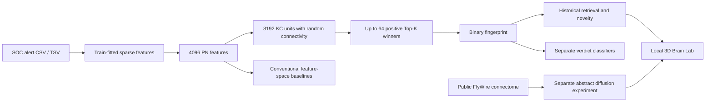

# FlySOC — A Drosophila-Inspired Neural Architecture for Security Operations

[](https://github.com/lucaslapinho/FlySOC/actions/workflows/tests.yml)
[](LICENSE)

**An open-source research lab for sparse SOC alert representations and connectome exploration.**

FlySOC asks whether computational principles inspired by the Drosophila Mushroom
Body can help retrieve related alerts, recognize recurrent verdict patterns,
detect novelty and support analyst review. It also provides a separate 3D
viewer for the public FlyWire connectome and exploratory graph diffusion.

This is a research prototype, not a complete brain simulation or a production
alert-suppression system. Current SOC results use synthetic data. They do not
demonstrate general superiority over conventional methods.

## Two independent research modes

| Mode | Computation | Visualization |
|---|---|---|
| Live FlySOC | Alert features → random expansion → sparse fingerprint → historical memory | Actual per-alert activations in a schematic PN/KC layout |
| Real connectome | Unsigned diffusion on the downloaded FlyWire graph | Real annotated positions and a sample of genuine graph edges |

The real connectome is **not yet used to classify SOC alerts**. Psychological
questions about attention, experience, fatigue and analyst decision-making are
future research interests; no human study or psychological validation has been
conducted. See the [research roadmap](docs/status.md) and the
[project changelog](CHANGELOG.md).



## Quick start — Windows PowerShell

Python 3.12 is recommended and was used for the initial measurements. Python 3.11+
is declared by the package; the automated workflow targets Python 3.12 on Windows
and Linux. The numerical pipeline uses CPU and sparse matrices. The browser
viewer requires WebGL2; no dedicated GPU, PyTorch or TensorFlow is required.

```powershell
git clone https://github.com/lucaslapinho/FlySOC.git
Set-Location FlySOC
py -3.12 -m venv .venv
& .\.venv\Scripts\python.exe -m pip install -e .
& .\.venv\Scripts\python.exe -m pytest -q

# Generate 5,000 alerts, train and evaluate chronologically
& .\.venv\Scripts\python.exe scripts/generate_synthetic_data.py
& .\.venv\Scripts\python.exe scripts/train.py
& .\.venv\Scripts\python.exe scripts/evaluate.py
& .\.venv\Scripts\python.exe scripts/validate_outputs.py
```

To reproduce the originally installed versions instead of resolving supported
ranges, install `requirements-lock.txt` before `pip install --no-build-isolation
--no-deps -e .`. The lock records one Windows/Python 3.12 environment. The
`bootstrap.ps1` script automates that path; supply `-PythonPath` if needed.

On Linux/macOS, use `python3.12 -m venv .venv`, then `.venv/bin/python` in place of
`.\.venv\Scripts\python.exe`. The core is portable Python; Windows launchers are
optional convenience scripts.

## Open the local research platform

After generating and training the SOC experiment above:

```powershell
# Download public research data and the pinned local renderer assets
& .\.venv\Scripts\python.exe scripts/download_connectome.py
& .\.venv\Scripts\python.exe scripts/prepare_connectome.py
& .\.venv\Scripts\python.exe scripts/vendor_web_assets.py
& .\.venv\Scripts\python.exe scripts/validate_brain_lab.py
& .\.venv\Scripts\python.exe scripts/brain_lab.py --open-browser
```

Open **http://127.0.0.1:8765** for the main FlySOC Home. It links the two focused
workspaces and shows the currently loaded model and connectome status:

- **Brain Lab:** http://127.0.0.1:8765/lab.html
- **Alert Analyzer:** http://127.0.0.1:8765/analyze.html

In **Brain Lab**, use **Apply pulse**, **Next step**, **Start/Pause**, rotate,
zoom and inspect points. In **Live FlySOC**, select test alerts or supply
a flat JSON alert. The six-stage Alert Decision Journey replays the computed
Alert → PN → KC → Top-K → Memory → Hypothesis trace, with manual stage controls,
nearest historical alerts, novelty and downstream classifier probabilities.
The English UI shows actual Python results per request; replay uses saved test
alerts and is not a connection to a production SOC. The hypothesis supports
analyst review and is not an automatic incident verdict.

The responsive research console separates experiment controls, the 3D scene and
the computed readout. Teal marks FlyWire diffusion, violet marks the engineered
FlySOC representation, and amber cards preserve scientific interpretation limits.

### Analyze your own alert

Open **http://127.0.0.1:8765/analyze.html** or choose **Alert Analyzer** in the
top navigation. The dedicated screen accepts:

- a manual form with common SOC fields;
- one flat JSON object pasted into the editor;
- JSON arrays and objects containing an `alerts` array;
- CSV or TSV exports with a header row.

Imported files are read by the local browser. Up to 1,000 records and 5 MB are
accepted, and only the selected flat alert is sent to the loopback Python
service. The screen replays Alert → PN → KC → Top-K → Memory → Hypothesis and
shows the 64-cell fingerprint, novelty, five historical matches and classifier
probabilities. Try [the small import example](docs/examples/alert_import_sample.csv).
Telemetry values remain inert strings and are never executed.

`Start-BrainLab.ps1` and `Start-BrainLab.cmd` launch the connected platform later.
Keep the server terminal open; Ctrl+C stops it. See the [Brain Lab guide](docs/brain_lab.md).

Downloaded data, JavaScript vendor assets, virtual environments, trained models
and generated results are intentionally excluded from Git. Scripts obtain or
regenerate them. The renderer runs locally after setup, without a runtime CDN.

## Initial measured results

Seed 42; 5,000 synthetic alerts; chronological **3,500 train / 750 validation /
750 test**. Credential dumping is absent from training and validation and forms
225 of the test alerts. All learned preprocessing is fitted on training only.

| Task | FlySOC representation | Original feature-space baseline |
|---|---:|---:|
| Retrieval Precision@5, 525 known-family queries | 0.9916 | 0.9935 |
| Random Forest macro-F1, all 750 test alerts | 0.8750 | 0.8052 |
| Nearest-neighbor novelty AUROC | 1.0000 | 1.0000 |
| False-merge pair rate at similarity threshold 0.75 | 3.7023% | 0.0131% |

The same numerical Jaccard/cosine threshold is not a matched operating point.
The baseline retrieved slightly better and produced fewer mixed-family merges.
Fly fingerprints were also larger in CSR storage and slower to query in the
initial implementation. Perfect novelty separation can reflect an easy synthetic
shift. Six classifiers and the poorly performing Isolation Forest baseline are
reported in the [full measured results](docs/initial_results.md).

The original pipeline had 37 passing tests; the current suite contains **47**.
Real-data validation checked source hashes, graph integrity, 30 diffusion steps
and 50 live traces against the original fingerprint computation. These checks
establish implementation consistency, not biological or operational validity.

## Configuration, data and reproduction

- Parameters: [config/default.yaml](config/default.yaml), including seed, feature
  dimensions, fan-in, Top-K, novelty percentile and temporal split ratios.
- Protocol and metric denominators: [experimental methodology](docs/experiments.md).
- Fields and missing values: [dataset schema](docs/dataset_schema.md).
- Modules and diagrams: [architecture](docs/architecture.md).
- Executed environment: [environment notes](docs/environment.md).
- Public numerical evidence: [benchmark snapshot](docs/benchmarks/README.md).

Generate a larger dataset with `--size 10000`. Pass `--config` to both generation
and training for custom experiments. Select saved models with `--run` when
supported by the command. Inspect a historical match with:

```powershell
& .\.venv\Scripts\python.exe scripts/inspect_alert.py --alert-id ALERT004251 --k 5
# Optional user-owned local export; timestamp is required for chronological evaluation
& .\.venv\Scripts\python.exe scripts/train.py --data .\data\raw\alerts.csv
```

Outputs are stored under unique run/evaluation directories in `results/` and
`models/`, with configuration, hashes, predictions and plots. Small `latest.json`
pointers identify current runs. Label changes through associative memory are
separate from classifier retraining and novelty recalibration.

## Experimental research modules

FlyHash remains the default representation. Setting `representation.backend` in
a separate config enables `connectome` or `rewired_connectome`; both require a
locally built, hash-verified PN-to-KC artifact. The deterministic feature-to-PN
bridge is an engineering adapter, while the measured matrix constrains only the
PN-to-KC stage. No MaleCNS data are committed to this repository.

```powershell
& .\.venv\Scripts\python.exe -m pip install -r requirements-research.txt
& .\.venv\Scripts\python.exe scripts\fetch_malecns_sources.py
# Add --download only when you deliberately start the later data-preparation phase.
```

`config/connectome_experiment.yaml` prepares matched FlyHash, measured-topology
and degree-preserving rewired comparisons across multiple seeds. LOF, One-Class
SVM, feature ablations and representation-specific deduplication calibration are
available for later experiments; none of those experiments is claimed here.

`flysoc.mbon_learning.MBONInspiredReadout` provides a separate KC-to-MBON
online readout with a configurable reward policy, bounded parameters and an
audit record for each feedback event. Evaluate it prequentially: predict an
alert, record that prediction, then apply its analyst label so the update can
affect only later alerts. It does not modify `AssociativeMemory` or enable
automatic alert suppression.

Connectome-topology experiments use separately downloaded datasets and must
preserve the source version, hashes, attribution and license. These experimental
modules do not establish biological fidelity, complete brain simulation or
superiority over conventional methods.

## Safety and scientific limits

Telemetry strings are always data. No process command line, payload, URL or file
path from an alert is executed. Never commit real SOC exports or credentials.
Only load trusted Joblib models; serialization can execute code. The web server
binds to loopback and is intended for a single local research session.

The connectome viewer uses annotated points, not full neuron morphology. Its
unsigned diffusion omits inhibitory dynamics, spikes, voltages, delays and
physiological validation. It is not a complete simulation of a fly brain.

## Contributing, license and citation

Original project code and documentation are licensed under **MIT**; see [LICENSE](LICENSE).
FlyWire public data retain **CC BY-NC 4.0** and are downloaded separately.
Three.js retains its MIT notice. See [third-party notices](THIRD_PARTY_NOTICES.md).

Read [CONTRIBUTING.md](CONTRIBUTING.md) to propose experiments or fixes and
[SECURITY.md](SECURITY.md) for responsible reporting. Cite the repository version
and commit using [CITATION.cff](CITATION.cff); cite FlyWire separately when using
its data. There is no project DOI or peer-reviewed FlySOC publication at this stage.
