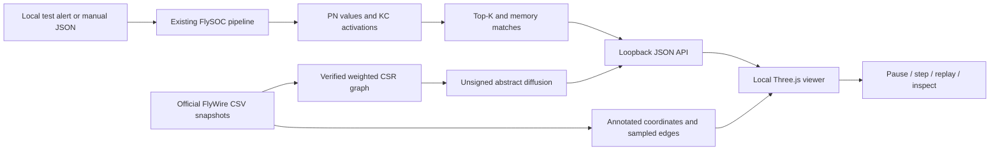
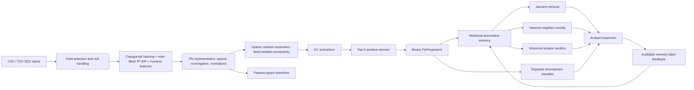

# FlySOC architecture

## Brain Lab v0.2 observability

The two modes are independent experiments. FlySOC still uses its original random
projection; the biological graph is not used to classify alerts. The Python
service traces actual computations per request, and the browser only renders
them. Biological coordinates are annotated positions, not neuron skeletons.
See [Brain Lab methods, measured tests and limitations](brain_lab.md).

## SOC research pipeline

FlySOC is a Drosophila-inspired computational architecture for comparing alert
representations. It is not a literal simulation of a fly brain, and biological
inspiration does not establish an advantage over conventional machine learning.

## Biological inspiration and engineering choices

The inspiration is expansion through sparse random connectivity followed by a
small winning subset, motivated by the fly olfactory circuit. The
[Salk research description](https://www.salk.edu/news-release/fruit-fly-brains-inform-search-engines-future/)
introduces the associated similarity-search research. The underlying publication
is Dasgupta, Stevens and Navlakha (2017), *A neural algorithm for a fundamental
computing problem*, Science, DOI: [10.1126/science.aam9868](https://doi.org/10.1126/science.aam9868).

In FlySOC, “PN” names an engineered feature vector; “KC” names a projected
coordinate. Neither has a measured correspondence to an individual biological
neuron. This implementation uses nonnegative feature hashing and TF-IDF, L2
normalization, binary random weights, seeded tie-breaking and sparse binary
outputs. These choices are engineering adaptations, not a reproduction of every
normalization, inhibition or learning mechanism in the biological circuit.

## Modules and contracts

| Module | Responsibility |
|---|---|
| `ingestion.py` | Read local CSV/TSV, validate IDs and chronological splits |
| `synthetic.py` | Deterministic patterns and test-only held-out family |
| `preprocessing.py` | Sparse feature extraction with training-only TF-IDF fitting |
| `flyhash.py` | Seeded sparse random projection and positive top-k selection |
| `similarity.py` | Jaccard, cosine, Hamming and batched exact nearest neighbors |
| `memory.py` | Fingerprint/metadata storage, append and label-feedback audit |
| `novelty.py` | Training leave-one-out nearest-neighbor threshold |
| `pipeline.py` | Representation, memory and novelty composition |
| `baselines.py` | Explicit downstream classifiers and Isolation Forest |
| `clustering.py` | Chronological exemplar-based deduplication |
| `metrics.py` | Ranking, per-class, novelty and false-merge metrics |
| `experiment.py` | Training, artifacts, split snapshots and integrity checks |
| `evaluation.py` | Four experiments, predictions, metrics and report |
| `plotting.py` | Headless matplotlib figures |
| `cli.py` | Generate/train/evaluate/inspect commands |

## Representation

Default PN width is exactly **4,096**: 2,048 categorical hash bins, 2,040 text
slots, and eight numeric slots. A vocabulary smaller than 2,040 is zero-padded.
Categorical hashing has `alternate_sign=False` to keep the input nonnegative;
collisions therefore accumulate. Identity features receive lower weight.
The numeric features are log-scaled source/destination ports, two port-presence
indicators and four shifted sine/cosine coordinates for UTC hour and weekday.
No statistical scaling is fitted to future data.

Text combines configured alert-name and command-line fields, using word unigrams
and bigrams. IP literals, long hex sequences and digits are normalized. TF-IDF
vocabulary and inverse document frequencies are learned on training rows only,
as specified by the [scikit-learn TF-IDF interface](https://scikit-learn.org/stable/modules/generated/sklearn.feature_extraction.text.TfidfVectorizer.html).

Each of 8,192 KCs receives exactly eight distinct PN inputs. The projection has
65,536 nonzero weights. Each row selects at most 64 strictly positive activations.
A seeded permutation resolves equal activations. Empty rows stay empty; rows
with fewer than 64 positive activations contain fewer active KCs. This avoids encoding
absent information as a shared nonempty fingerprint.

## Similarity and memory

For binary fingerprints A and B, Jaccard is `|A ∩ B| / |A ∪ B|`. Cosine is
`|A ∩ B| / sqrt(|A||B|)`. Normalized Hamming distance is
`|A △ B| / kc_dim`; the helper returns one minus this distance. A zero vector
has similarity zero under all three conventions, including to another zero.
Hamming similarity can look deceptively high because most KC bits are inactive.

Exact search processes 128 query rows at a time. Its memory use scales with
batch size times historical alert count; it does not retain a complete
all-pairs matrix. KC activations are dense only within the encoding batch.
The index keeps float32 fingerprints for safe overlap accumulation, while
persisted encoded fingerprints are uint8 CSR. This is sparse storage, not bit
packing and not guaranteed compression versus the PN representation.

Memory stores the supplied metadata, including alert ID/name, timestamp, verdict,
host, user and technique when present. `update_feedback()` updates a stored
verdict and records its prior value, note and timestamp. Updated labels are
visible in retrieval immediately. They do not silently retrain classifiers or
change a calibrated novelty threshold. `add()` appends history; recalibration is
explicit. These operations are currently Python APIs, not production integrations.

## Novelty and classification are separate

Novelty is `1 - maximum historical similarity`. Calibration computes each
training row's nearest neighbor while excluding that row itself. The threshold
is the configured percentile (default 99), and flags require strictly greater
scores. Recurring duplicate patterns can drive this threshold downward.

Logistic Regression, Random Forest and kNN are downstream estimators, each fit
separately to PN features and Fly fingerprints. A nearest historical verdict or
a classifier prediction is a hypothesis for analyst review, not a confirmed
incident determination.

## Future architecture

Future work may add KC-to-output-unit weights inspired by Mushroom Body Output
Neurons (MBONs), with analyst feedback acting as a reinforcement signal. The
sign and magnitude of updates require an explicit operational loss function;
“true positive = positive reward” is not automatically the right policy.
Dopaminergic reinforcement, neural dynamics and biologically realistic learning
are **not implemented** in v0.1.

Vendor adapters should map exports to this generic schema in a separate module.
There is no live Cortex XSIAM/XDR integration, tenant assumption or API access.
